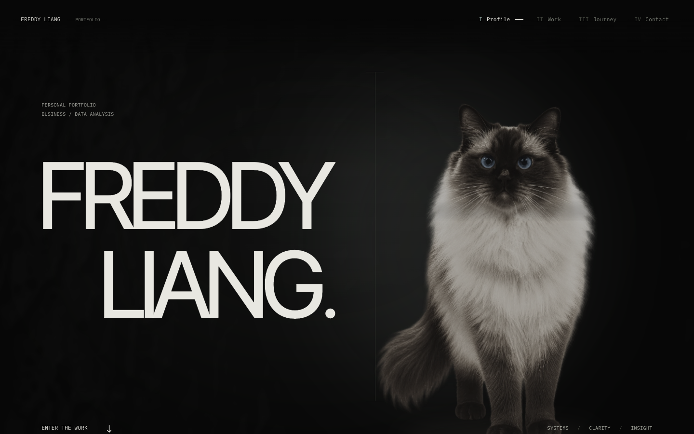

# Freddy Liang · Portfolio

A personal portfolio for business and data analysis work, built around **systems, clarity and insight**.

[View the live portfolio](https://freddy-liang-sprint-one.rachelzhanzst.chatgpt.site) · [Continue with Claude](HANDOFF.md) · [Domain setup](docs/DEPLOYMENT.md)



The homepage unfolds through interactive Mochi, selected projects, and a draggable journey through Seattle, Beijing, Shenzhen and Melbourne. Project images open Sage Vista and the relevant Lab repositories; the Power BI pages open in a full-screen viewer. A Profile panel opens from the hero name.

## Run locally

Use Node.js 22 and npm. No API keys, database or environment variables are required.

```sh
git clone https://github.com/327979420/freddy-liang-portfolio.git
cd freddy-liang-portfolio
npm ci
npm run dev
```

Open `http://127.0.0.1:3000`. Add `?intro=off` to skip the opening during review.

```sh
npm run build
npm run typecheck
```

The production website is exported to `out/`. For a local production preview, run `python3 -m http.server 3000 --bind 127.0.0.1 --directory out`. This project uses static export, so the inherited `npm start` command is not the production preview command.

## Continue the work

Read [HANDOFF.md](HANDOFF.md) first. Sprint 1.6 (colour Mochi, four named chapters, compact contact ending, and the storyboard's reveal/cursor interactions) is implemented in source; see [docs/NEXT-CHANGES.md](docs/NEXT-CHANGES.md). Deployment is separate.

The current implementation is Next.js 16.3.6, React 19.2.4 and TypeScript. GitHub Actions builds the site and provides a downloadable static export. Pushing to GitHub does **not** automatically update the existing live site. See [deployment instructions](docs/DEPLOYMENT.md).

Source, project screenshots, Mochi reference photographs, design notes and review evidence are included. See [asset credits](ASSET-CREDITS.md) for origins and third-party licenses. No blanket license is granted for the owner's photographs or branding.
